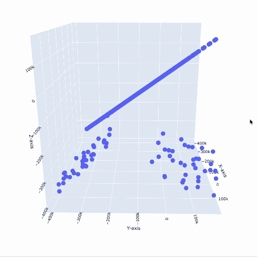
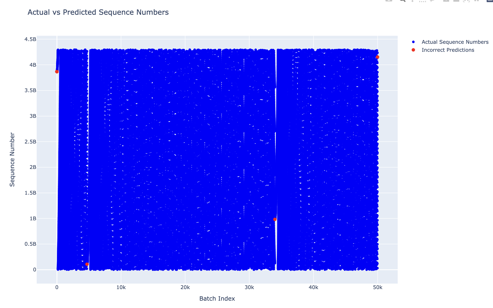

# Sequence Number Prediction Attack

___

## Vulnerability to be exploited

There is a trust relationship between server and X-Terminal. It allows users logged into server to execute commands via
a TCP/IP network without supplying a password.

## How TCP Works

Every sent packet has a sequence number (SN). The SN is used to reassemble the packets in the correct order, detect
duplicate packets and to acknowledge the receipt of packets. The ACK number is always set to the next expected
SN `(ACK_n = SN + 1)`.

### How TCP establishes a connection

To establish a client-server connection a 3-way handshake is used.

1) The server is in LISTEN state. The client sends a SYN packet with its SN `x` to the server and transfers to a
   SYN-SENT state.
2) On this packet receive, the server transfers to SYN-RECEIVED state and sends a SYN-ACK packet in response. This
   SYN-ACK packet includes an initial sequence number (ISN) `y` and an ACK number `x + 1`.
3) When the client receives the SYN-ACK packet it transfers to ESTABLISHED state and sends an ACK packet with the
   SN `y + 1` and the ACK number `x + 1`. This packet already may contain data.
4) The server receives the ACK packet and transfers to ESTABLISHED state.

### How TCP passes data

As the connection is established, the client and the server can send data to each other.
Client already learned the SN `y` of the server, and the server knows the SN `x` of the client.

Whenever client wants to send data to the server, it sends a packet with:

- the SN, which is the last ACK number received from the server;
- and the ACK number, which is the last SN received from the server

### How TCP resets a connection

`RST` flag is used like a panic button. Whenever server or client receives a packet with `RST` flag set, it immediately
closes the connection. This may happen for example in case some client receives a SYN-ACK packet from the server, but
client have not sent a SYN packet before, or already established the connection.

## Attack Preparation: Sequence Number Prediction

The attack is based on the fact that the sequence number is predictable. To find pattern in the sequence numbers, I
run `scan_sn.sh` script in one terminal window, and in another terminal window I
run `sudo tcpdump -i eth0 src xterminal and 'tcp[tcpflags] & tcp-syn != 0'` to listen for
SYN packets from the X-Terminal.

I store the logs to `logs.txt` and analyse them in `tcp_logs_analyse_sequence_numbers.py`. First, I calculate the
difference between the last three SN the same way as done was done by Robert T. Morris [3].

```python
x[n] = s[n - 2] - s[n - 3]
y[n] = s[n - 1] - s[n - 2]
z[n] = s[n] - s[n - 1]
```

The results of the 500 sequential SN are shown in the following animation:


One can see that the SN are clearly not random. To find the pattern I try to fit scipy.LinearRegression and Polynomial
Regression models to the data, but they do not produce good results. The mapping of the raw SN to x,y and z produce a
interesting pattern of x,y, and vectors, with linear increase and then reset in 20-30 iterations. While the SN are
have some polynomial seasonality pattern.

The formula was found (cannot be disclosed) and for a dataset of 50,000 sequential SN, the prediction error is ~00.005%.



## Sources

[1] [Mike Shiffman (aka route|daemon9): IP Spoofing Demystified](http://phrack.org/issues/48/14.html)

[2] [Robert T. Morris: A Weakness in the 4.2BSD Unix TCP/IP Software](http://pdos.csail.mit.edu/~rtm/papers/117.pdf)

[3] [Steve M. Bellovin: A Look Back at “Security Problems in the TCP/IP Protocol Suite”](http://www.cs.columbia.edu/~smb/papers/ipext.pdf)
